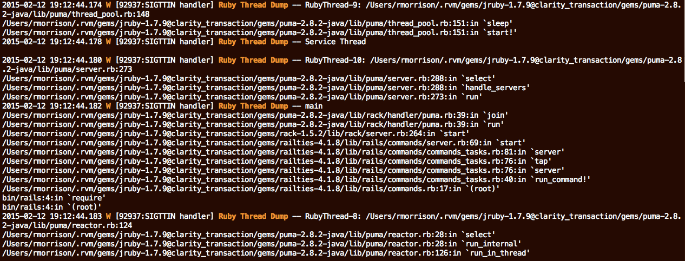

## Linux Signals

For Linux, Unix, and Mac, Semantic Logger can register callbacks for specific
signals.

On startup Semantic Logger does not register any signals so that it does not
interfere with any existing signal handlers. The signal handler must be explicitly
registered by calling `SemanticLogger.add_signal_handler`

Add a Rails initializer:

~~~ruby
# config/initializers/semantic_logger.rb
SemanticLogger.add_signal_handler
~~~
Or, enabling Log Level Signal handler for a stand-alone application:

~~~ruby
# Enable signal handling for this process
SemanticLogger.add_signal_handler
~~~

The following capabilities are available by using the corresponding signal:

### Changing the log_level (USR2)

The global default logging level can be changed by sending the process a SIGUSR2
signal without having to restart the process.

When the signal is sent, the global default log level rotates through the following
log levels in the following order, starting from the current global default level:

~~~ruby
  :warn, :info, :debug, :trace
~~~

If the current level is `:trace` it wraps around back to `:warn`

Example (where the target ruby process id is 1234) :

~~~
kill -SIGUSR2 1234
~~~

Note: The changes to the logging level will not change for any classes where the
level was set explicity within the application itself. The above signal only changes
the global default level, which is used by loggers when their log level has not
been overridden.

### Logging a Ruby thread dump (TTIN)

When the `TTIN` signal is sent to this process, Semantic Logger will write the list
of threads to the log file, along with their back-traces when available

For JRuby users this thread dump differs form the standard `QUIT` triggered
Java thread dump which includes system threads and Java stack traces.

It is recommended to name any threads you create in the application, by
calling the following from within the thread itself:
~~~ruby
Thread.current.name = 'My Worker'
~~~

Example (where the target ruby process id is 1234) :

~~~
kill -TTIN 1234
~~~

### JRuby Garbage collection event logging

For JRuby, any Garbage Collection events that take longer than 10ms are logged
as a warning to the regular log file and other appenders.

This information is critical in high load scenarios to give visibility on any
Garbage Collection that could affect active web requests or other processing.

### Overriding signals

To only register one of the signal handlers, set the other to nil
Set gc_log_microseconds to nil to not enable JRuby Garbage collections

~~~ruby
# Set the log level change signal to USR1
# Set the thread dump signal to 'USR2'
# Set the Garbage collection minimum threshold to 100,000 micro-seconds
SemanticLogger.add_signal_handler('USR1', 'USR2', 100000)
~~~

### [Next: Forking ==>](forking.html)
